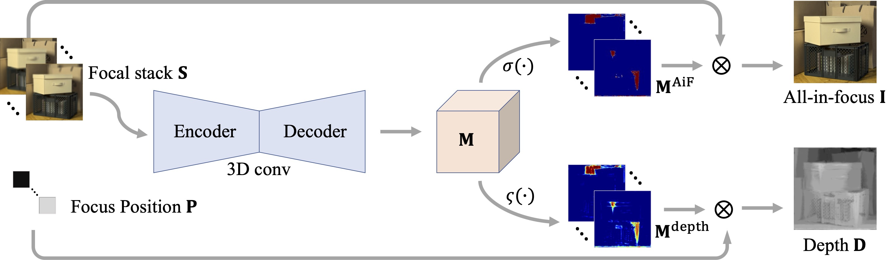
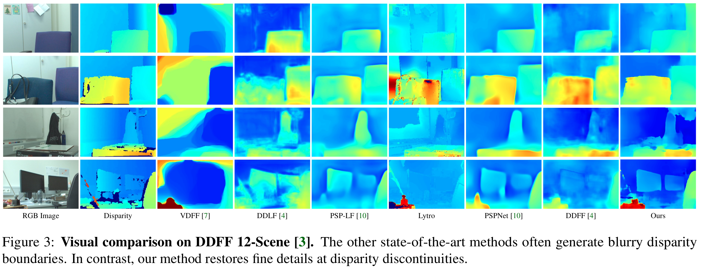
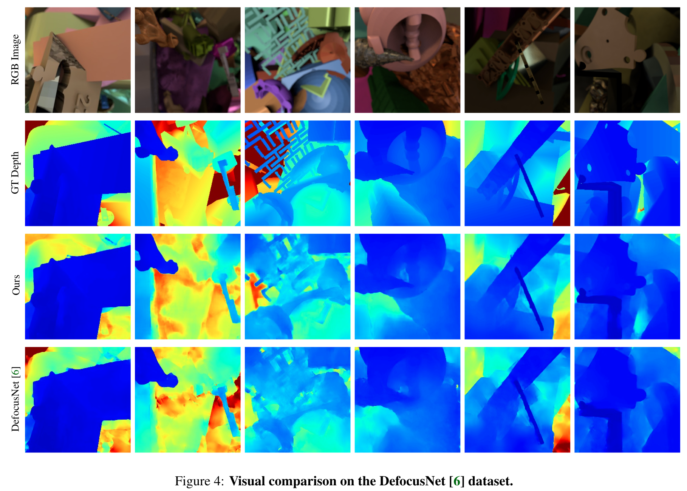
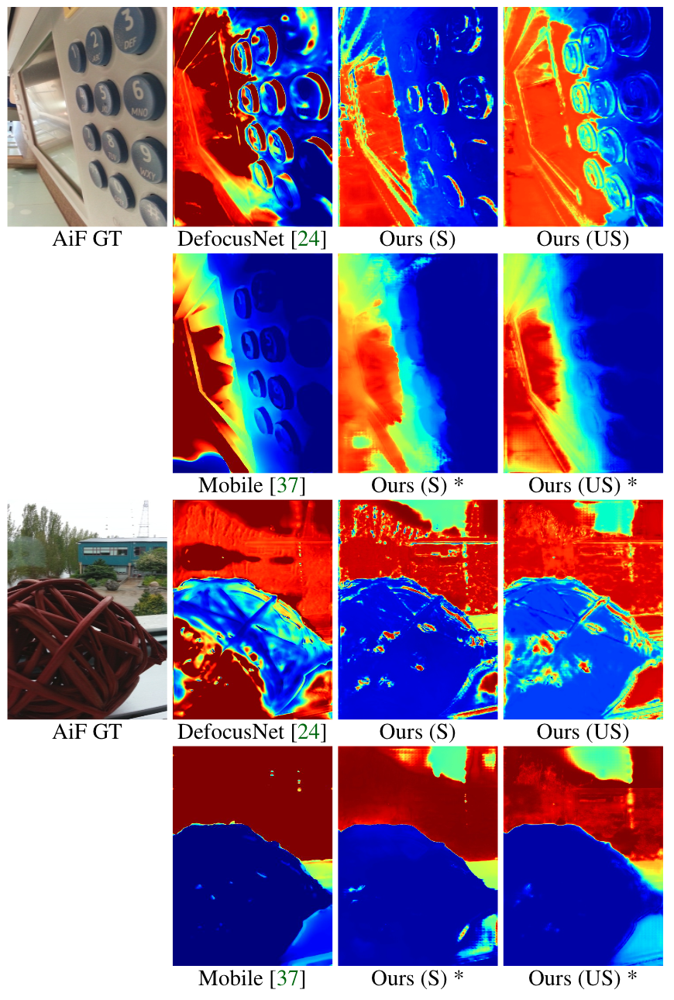
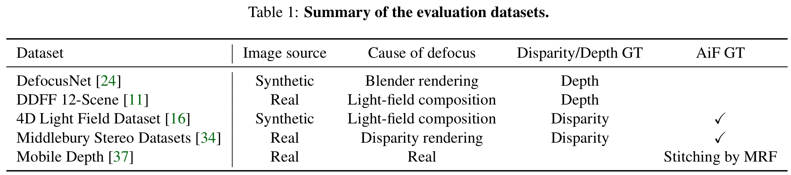

# [ICCV 2021] Bridging Unsupervised and Supervised Depth from Focus via All-in-Focus Supervision

[Project Page](https://albert100121.github.io/AiFDepthNet/) | [Paper (Arxiv)](https://arxiv.org/abs/2108.10843)

Depth estimation is a long-lasting yet important task in computer vision. Most of the previous works try to estimate depth from input images and assume images are all-in-focus (AiF), which is less common in real-world applications. On the other hand, a few works take defocus blur into account and consider it as another cue for depth estimation. In this paper, we propose a method to estimate not only a depth map but an AiF image from a set of images with different focus positions (known as a focal stack). We design a shared architecture to exploit the relationship between depth and AiF estimation. As a result, the proposed method can be trained either supervisedly with ground truth depth, or unsupervisedly with AiF images as supervisory signals. We show in various experiments that our method outperforms the state-of-the-art methods both quantitatively and qualitatively, and also has higher efficiency in inference time.

## Overview

This is the official **PyTorch** implementation of  
*"Bridging Unsupervised and Supervised Depth from Focus via All-in-Focus Supervision"*,  
[Ning-Hsu Wang](http://albert100121.github.io/), [Ren Wang](https://tw.linkedin.com/in/ren-wang-61b273160), [Yu-Lun Liu](http://www.cmlab.csie.ntu.edu.tw/~yulunliu/), [Yu-Hao Huang](https://www.linkedin.com/in/yu-hao-huang-72821060/?originalSubdomain=tw), [Yu-Lin Chang](https://scholar.google.com/citations?user=0O9rukQAAAAJ&hl=en), [Chia-Ping Chen](https://tw.linkedin.com/in/chia-ping-chen-81674078), [Kevin Jou](https://corp.mediatek.com/investor-relations/corporate-governance/corporate-management)  ([National Tsing Hua University](http://nthu-en.site.nthu.edu.tw), [MediaTek Inc.](https://www.mediatek.com)) in **International Comference on Computer Vision (ICCV) 2021** conference. If you find this code useful for your research, please consider citing the following paper and star this repo.



## Requirements
- Python == 3.6.8
- PyTorch == 1.5.1
- torchvision == 0.6.1
- h5py == 2.8.0
- tensorboardX == 2.1
- tqdm = 4.47.0
- *see ```requirements.txt``` for more detail*

## Usage 
#### 1. Download Dataset
**DDFF-12-Scene Dataset**
1. Download trainval and test h5py to ```./data```
[ddff-dataset-trainval.h5py](https://vision.in.tum.de/webarchive/hazirbas/ddff12scene/ddff-dataset-trainval.h5)
[ddff-dataset-test.h5py](https://vision.in.tum.de/webarchive/hazirbas/ddff12scene/ddff-dataset-test.h5)

**DefocusNet Dataset**
1. Download zip file to ```./data/DefocusNet_Gen```
    - [Official Link](https://drive.google.com/file/d/1bR-WZQf44s0nsScC27HiEwaXPyEQ3-Dw/view)

2. Run the following script under ```./data/DefocusNet_Gen```
    ```bash
    unzip fs_6.zip
    python DefocusNet_gen_txt.py
    cd ../../

    ``` 
**4D-Light-Field Dataset**
1. Go to this [website](https://lightfield-analysis.uni-konstanz.de) to request for the 4D-Light-Field dataset
2. Download ```full_data.zip``` under ```./data/4D-Light-Field_Gen```
3. Run ```./Gen_h5py.sh``` under  ```./data/4D-Light-Field_Gen```

**FlyingThings3D Dataset**
1. Download [FlyingThings3D_FS](https://drive.google.com/file/d/1tYuaJ2G2PWYWJs6pfrDcsLGgeohhsqA_/view?usp=sharing) under ```./data/Barron2015_Gen/```
2. Unzip the dataset

**Middlebury Dataset**
1. Download [Middlebury_FS](https://drive.google.com/file/d/1VaMTYNvReg83dtkDPxPHzkxjtLgITtRA/view?usp=sharing) under ```./data/Barron2015_Gen/```
2. Unzip the dataaset

**Mobile Depth Dataset**
1. Download both zip files from https://www.supasorn.com/dffdownload.html to ```./data/Mobile_Depth_Gen```
2. Run ```./Mobile_Depth_gen_txt.sh``` under ```./data/Mobile_Depth_Gen```

#### 2. Download Pretrained Model
1. Download the ckpt.zip file and upzip
[ckpt.zip](https://drive.google.com/file/d/1Lk4tJ7AKRJPGIfAjhxVMXoEFZBplmkHp/view?usp=sharing)

#### 3. Prepare Runtime Environment
Install packages from requirements.txt in your conda environment.
```bash
conda create --name AiFDepthNet --file requirements.txt -c pytorch
conda activate AiFDepthNet
```

#### 4. Run The following command
```bash
CUDA_VISIBLE_DEVICES=[GPU_ID] python test.py --txt(optional) [path to the txt file of the dataset] --h5py(optional) [path to the h5py file of the dataset] --pth [path to your pretrained model] --outdir(optional) [path to your output results storage] --dataset [dataset name] --disp_depth [pretrained model is trained with disparity or depth] --test(optional) [Run DDFF-12-Scene Dataset on testing data]
```

## Results
#### DDFF-12-Scene Dataset



#### DefocusNet Dataset



#### 4D Light Field Dataset


#### Mobile Depth Dataset



## Dataset


## Citation
Please cite our paper if you find the code or dataset useful for your research.

```bibtex
@inproceedings{Wang-ICCV-2021,
        author    = {Wang, Ning-Hsu and Wang, Ren and Liu, Yu-Lun and Huang, Yu-Hao and Chang, Yu-Lin and Chen, Chia-Ping and Jou, Kevin}, 
        title     = {Bridging Unsupervised and Supervised Depth from Focus via All-in-Focus Supervision}, 
        booktitle = {International Conference on Computer Vision},
        year      = {2021}
}
```

## Resources
- [DDFF-12-Scene](https://hazirbas.com/datasets/ddff12scene/)
- [4D Light Field Dataset](https://lightfield-analysis.uni-konstanz.de)
- [DefocusNet](https://github.com/dvl-tum/defocus-net)
- [Mobile Depth Dataset](https://www.supasorn.com)
- [Middlebury Dataset](https://vision.middlebury.edu/stereo/data/)
- [FlyingThings3D Dataset](https://lmb.informatik.uni-freiburg.de/resources/datasets/SceneFlowDatasets.en.html)
## Acknowledgement
- [MediaTek Inc.](https://www.mediatek.tw)